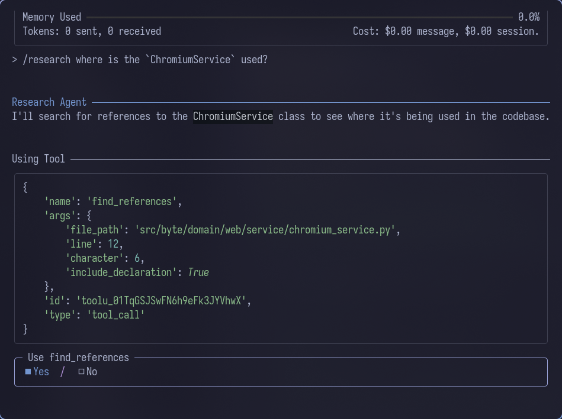

# LSP (Language Server Protocol)

Byte's LSP integration provides code intelligence features like hover information, go-to-definition, find references, and completions by connecting to language servers. It manages multiple LSP servers simultaneously, routing requests to the appropriate server based on file extensions.



---

## Quick Start

### Enable LSP

Configure LSP in `.byte/config.yaml`:

```yaml
lsp:
  enable: true
  timeout: 30
  servers:
    typescript:
      command: ["typescript-language-server", "--stdio"]
      file_extensions: ["ts", "tsx", "js", "jsx"]
    python:
      command: ["pylsp"]
      file_extensions: ["py", "pyi"]
```

### Use with Research Agent

LSP tools are **only available through the `/research` command**:

```
> /research Find all references to the UserService class
```

The research agent will use LSP tools like `find_references`, `get_definition`, and `get_hover_info` to analyze your codebase and provide detailed findings.

**Research findings are saved to session context** rather than the conversation history. This allows other agents to reference the research results without cluttering the message thread. The findings remain available throughout your session for the AI to use when making decisions or generating code.

Byte will:

1. Start configured LSP servers in the background on boot
2. Automatically open documents when you add them to context
3. Provide code intelligence through LSP tools to the research agent
4. Route requests to the appropriate server based on file extension

---

## Configuration

### Server Configuration

Each LSP server requires:

**`command`** (array of strings, required)

- Command and arguments to start the LSP server
- Example: `["typescript-language-server", "--stdio"]`
- Server must support stdio communication

**`file_extensions`** (array of strings, required)

- File extensions this server handles
- Example: `["ts", "tsx", "js", "jsx"]`
- Used to route requests to correct server

**`initialization_options`** (object, optional)

- Custom initialization options passed to the server
- Server-specific configuration

### Example Configuration

```yaml
lsp:
  enable: true
  timeout: 30
  servers:
    typescript:
      command: ["typescript-language-server", "--stdio"]
      file_extensions: ["ts", "tsx", "js", "jsx"]
      initialization_options:
        preferences:
          includeInlayParameterNameHints: "all"

    python:
      command: ["pylsp"]
      file_extensions: ["py", "pyi"]
      initialization_options:
        pylsp:
          plugins:
            pycodestyle:
              enabled: false

    rust:
      command: ["rust-analyzer"]
      file_extensions: ["rs"]
```

See the [Settings Reference](../reference/settings.md#lsp) for complete configuration options.

---

## Available Tools

The **Research Agent** (`/research` command) has exclusive access to LSP functionality through these tools. Other agents do not have access to LSP features.

### Get Hover Information

Get documentation and type information for a symbol:

```python
get_hover_info(file_path="src/main.ts", line=10, character=5)
```

Returns:

- Documentation strings
- Type signatures
- Parameter information

### Go to Definition

Find where a symbol is defined:

```python
get_definition(file_path="src/main.ts", line=10, character=5)
```

Returns:

- Definition location(s)
- File path and line/column range
- Code context around definition

### Find References

Find all references to a symbol:

```python
find_references(file_path="src/main.ts", line=10, character=5, include_declaration=False)
```

Returns:

- All reference locations grouped by file
- Code context for each reference
- Line and column information

---

## Related Concepts

- [File Context](file-context.md) - Files must be in context for LSP to work
- [Conventions](conventions.md) - Document language-specific patterns
- [Settings Reference](../reference/settings.md) - Complete LSP configuration options
