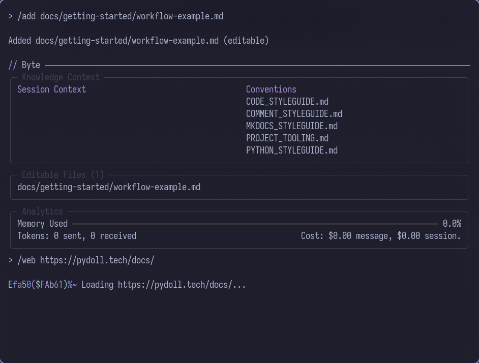

# Web

Byte's web command allows you to scrape web pages and convert them to markdown format for use in your AI conversations. It uses headless Chrome to fetch pages, handles JavaScript-rendered content, and converts HTML to clean markdown that can be added to the LLM context.



---

## Quick Start

Scrape a webpage:

```
> /web https://example.com
```

Byte will:

1. Launch headless Chrome browser
2. Navigate to the URL and wait for JavaScript to render
3. Extract the page content
4. Convert HTML to markdown format
5. Display the formatted content
6. Prompt you to add it to the LLM context

---

## Configuration

Configure web functionality in `.byte/config.yaml`:

```yaml
web:
  enable: true
  chrome_binary_location: /usr/bin/google-chrome
```

For complete configuration details, see the [Settings Reference](../reference/settings.md#web).

---

## Context Integration

After displaying the content, you have three options:


## Yes

Add raw markdown directly to context

The content is stored with a key derived from the URL slug for easy reference.

## Clean with LLM

Use AI to extract relevant information

The cleaner agent:

- Removes navigation, footers, and boilerplate
- Extracts main content and key points
- Formats it for optimal LLM comprehension
- Adds cleaned version to context

## No

Discard the content

The scraped content is not added to the context.
