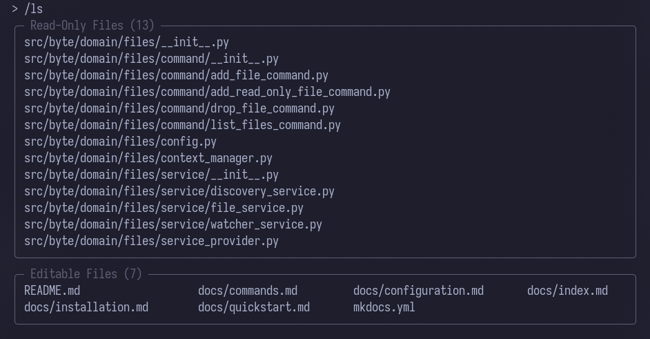

# File Commands

File commands control which files Byte is aware of during your session. Only files explicitly added to the context are visible to the AI agent.

## Overview

Byte uses an explicit file context model - the AI only sees files you've added. This gives you precise control over what the agent can read and modify.

All file operations respect your `.gitignore` patterns and project configuration automatically through the File Discovery Service, which scans your project on boot. You can customize which files are excluded from discovery by adding additional ignore patterns to your `.byte/config.yaml` file under the `files.ignore` setting. For detailed information on configuring file discovery and ignore patterns, see the [Configuration documentation](../configuration.md#file-discovery).

## Available Commands

### `/add` - Add Files as Editable

Add one or more files to the active context with editable permissions, allowing the AI to propose modifications using SEARCH/REPLACE blocks.

**Usage:**

```
/add <path>
```

**Arguments:**

- `path`: File path or glob pattern (e.g., `src/*.py`)

**Examples:**

```
# Add a single file (editable)
> /add src/main.py
Added src/main.py (editable)

# Add multiple files with glob pattern
> /add src/*.py
Added src/auth.py (editable)
Added src/utils.py (editable)
Added src/config.py (editable)

# Add all Python files recursively
> /add src/**/*.py
```

---

### `/read-only` - Add Files as Read-Only

Add files to context that the AI can reference but not modify. Perfect for documentation, configuration files, or code examples.

**Usage:**

```
/read-only <path>
```

**Arguments:**

- `path`: File path or glob pattern

**Examples:**

```
# Add configuration as reference
> /read-only config.yaml
Added config.yaml (read-only)

# Add documentation for context
> /read-only README.md
Added README.md (read-only)

# Add all test files as examples
> /read-only tests/**/*.py
Added tests/test_auth.py (read-only)
Added tests/test_utils.py (read-only)
```

---

### `/drop` - Remove Files from Context

Remove files from the active context to reduce noise and focus the AI's attention.

**Usage:**

```
/drop <path>
```

**Arguments:**

- `path`: File path or glob pattern to remove

**Examples:**

```
# Remove a single file
> /drop src/main.py
Removed src/main.py from context

# Remove all Python files
> /drop src/*.py
Removed src/auth.py from context
Removed src/utils.py from context

# Remove all files in directory tree
> /drop tests/**/*
```

---

### `/ls` - List Files in Context

Display all files currently available to the AI, organized by access mode.

**Usage:**

```
/ls
```

**Output:**
Shows files in two panels with counts:



---

## Glob Pattern Reference

File commands support powerful glob patterns for batch operations:

| Pattern  | Matches                              | Example                                   |
| -------- | ------------------------------------ | ----------------------------------------- |
| `*`      | Any characters in filename/directory | `src/*.py` → all .py files in src/        |
| `**`     | Any number of directories            | `src/**/*.py` → all .py files recursively |
| `?`      | Single character                     | `test?.py` → test1.py, testA.py           |
| `[abc]`  | Any character in brackets            | `file[123].py` → file1.py, file2.py       |
| `[!abc]` | Any character NOT in brackets        | `file[!0-9].py` → fileA.py (not file1.py) |

**Pattern examples:**

```bash
# All Python files in src/ directory only
> /add src/*.py

# All Python files in src/ and subdirectories
> /add src/**/*.py

# All config files
> /add *.{yaml,yml,json,toml}

# All test files following naming convention
> /add tests/test_*.py

# All files in specific directories
> /add {src,lib}/**/*.py

# Numbered files
> /add chapter[0-9].md
```

**Pattern matching behavior:**

- Patterns are matched against file paths relative to project root
- `*` does not match directory separators (`/`)
- `**` matches zero or more directories
- Patterns are case-sensitive on Linux/macOS, case-insensitive on Windows
